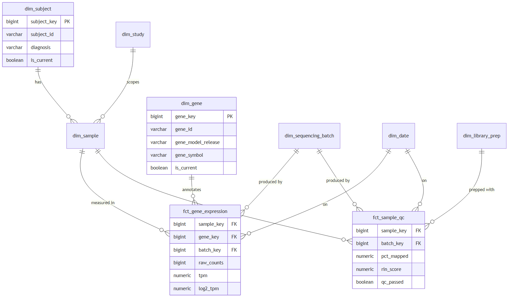
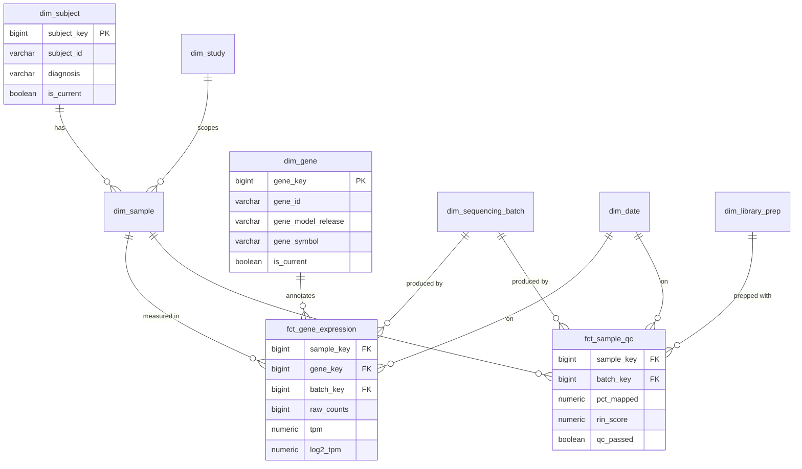

# Analytical Data Model (Gold Layer)

*Design note (no implementation). This is the model the Silver → Gold dbt layer would
build (see the platform design).*

## Approach: Kimball star: and why

**Chose a Kimball dimensional star over Data Vault and One Big Table.**

- **Over Data Vault:** defensible if an organisation had many source systems and heavy audit/compliance
  needs, it does not yet, and a 1–2 person team cannot afford the hub/link/satellite overhead plus a
  business-vault layer on top just to answer three recurring questions.
- **Over One Big Table:** genuinely attractive for the gene-expression grain (scientists love a
  single wide table in DuckDB), so we ship **OBT-style denormalised marts *on top of* the star**,
  which is the honest "both" answer: governed conformed dimensions underneath, ergonomic wide
  extracts on top.

The consumers are scientists and biostatisticians writing SQL and R against a BI tool. A star is the
thing they can read without a data engineer in the room.

## Two fact tables, two grains

| Fact | Grain | Notes |
|---|---|---|
| **`fct_gene_expression`** | one row per **sample × gene** | The big one (20k genes × N samples). Cluster/partition by `study_key`, `gene_key`. Measures: `raw_counts`, `tpm`, `log2_tpm`. |
| **`fct_sample_qc`** | one row per **sample** (accumulating snapshot) | All QC metrics, both assay flavours, nullable per assay. Keeps the wide, sparse QC columns *out* of the huge expression fact. |

Splitting grains keeps the massive fact narrow (three measures) and puts the sparse per-assay QC in
its own per-sample table, so a QC-drift query never scans the billion-row expression fact.

## Dimensions

| Dimension | SCD | Key attributes |
|---|---|---|
| `dim_subject` | **SCD2** | pseudonymous subject id, diagnosis, arm, *diagnosis gets revised* |
| `dim_sample` | SCD1 | tissue, assay_type, condition_arm, `is_evaluable` |
| `dim_gene` | **versioned by gene_model** | `gene_id` (ENSG), `gene_model_release`, symbol, biotype |
| `dim_study` | SCD1 | study code, indication, sponsor |
| `dim_sequencing_batch` | SCD1 | batch, CRO, instrument, flow cell, run date, **the batch-effect dimension** |
| `dim_library_prep` | junk dim | kit, version, strandedness combos |
| `dim_date` | static | calendar |

## DDL sketch (abbreviated: this level of detail is enough)

```sql
CREATE TABLE dim_gene (
  gene_key            BIGINT PRIMARY KEY,        -- surrogate
  gene_id             VARCHAR(32) NOT NULL,      -- ENSG..., natural key
  gene_model_release  VARCHAR(32) NOT NULL,      -- 'GRCh38/Ensembl110'
  gene_symbol         VARCHAR(64),               -- annotation, lives here, NOT in the fact
  biotype             VARCHAR(64),
  chromosome          VARCHAR(8),
  valid_from          DATE NOT NULL,
  valid_to            DATE,
  is_current          BOOLEAN NOT NULL,
  UNIQUE (gene_id, gene_model_release, valid_from)
);

CREATE TABLE dim_sequencing_batch (
  batch_key         BIGINT PRIMARY KEY,
  sequencing_batch  VARCHAR(64) NOT NULL,
  cro               VARCHAR(128),
  instrument_model  VARCHAR(128),
  flow_cell_id      VARCHAR(64),
  run_date          DATE,
  UNIQUE (sequencing_batch, cro)
);

CREATE TABLE fct_gene_expression (
  sample_key   BIGINT NOT NULL REFERENCES dim_sample,
  gene_key     BIGINT NOT NULL REFERENCES dim_gene,
  batch_key    BIGINT NOT NULL REFERENCES dim_sequencing_batch,
  date_key     INT    NOT NULL REFERENCES dim_date,
  raw_counts   BIGINT NOT NULL,
  tpm          NUMERIC(12,4),                    -- NULL for scRNA-seq
  log2_tpm     NUMERIC(12,6),
  PRIMARY KEY (sample_key, gene_key)
);
```

`gene_symbol` sits in `dim_gene`, **never** in the fact or in `sample_expression`, a symbol is
mutable annotation, not a measurement; storing it per fact row would duplicate mutable data across
millions of rows and invite disagreement about "the" symbol for a gene.

## Slowly-changing attributes: the domain-aware part

- **Subject diagnosis revised → SCD2 on `dim_subject`.** Analyses must be reproducible: a cohort
  built in March must be rebuildable in June even if a diagnosis was corrected in May. Facts join on
  the surrogate key valid *at sample-collection time* (**as-was**); `is_current` is also exposed for
  **as-is-now** queries. Naming both patterns is the point.
- **Gene annotation revised → NOT ordinary SCD2**, and saying so is the credibility signal.
  Expression values are only comparable *within the gene model they were quantified against*, so
  `dim_gene` is keyed by `(gene_id, gene_model_release)` and every fact row points at the gene key
  matching **its own** `gene_model`. Re-annotation creates *new* dimension rows and never mutates old
  ones; cross-release comparisons must go through an explicit mapping and be flagged. (Ensembl
  retires/merges gene IDs between releases, a real problem, not hypothetical.)
- **`dim_sample.tissue` typo fix → SCD1** (overwrite), with the change captured in
  `sample_payload_log`. A typo does not deserve a new surrogate key.

## Two example queries (deck material)

**(a) Disease-vs-control fold change per gene for an indication:**
```sql
WITH grouped AS (
  SELECT g.gene_symbol, s.condition_arm,
         AVG(f.log2_tpm) AS mean_log2_tpm, COUNT(*) AS n
  FROM fct_gene_expression f
  JOIN dim_gene   g  ON g.gene_key   = f.gene_key
  JOIN dim_sample s  ON s.sample_key = f.sample_key
  JOIN dim_study  st ON st.study_key = s.study_key
  WHERE st.indication = 'NSCLC'
    AND s.is_evaluable                          -- one certified definition, one place
    AND g.gene_model_release = 'GRCh38/Ensembl110'
  GROUP BY 1, 2
)
SELECT gene_symbol,
       MAX(CASE WHEN condition_arm = 'disease' THEN mean_log2_tpm END)
     - MAX(CASE WHEN condition_arm = 'control' THEN mean_log2_tpm END) AS log2_fold_change
FROM grouped GROUP BY 1 ORDER BY 2 DESC LIMIT 50;
```
**Honest caveat:** this is a *screening* view, not differential expression. Real DE needs
DESeq2/limma on raw counts with covariates (including `~ batch`). The warehouse's job is to hand a
clean, batch-annotated count matrix to those tools, not to replace them. Knowing where the platform
boundary sits is the point.

**(b) QC drift by batch and CRO over time, surfaces silent quality regressions:**
```sql
SELECT b.cro, b.sequencing_batch, d.year_month,
       COUNT(*)                                     AS n_samples,
       ROUND(AVG(q.pct_mapped), 2)                  AS avg_pct_mapped,
       ROUND(AVG(q.rin_score), 2)                   AS avg_rin,
       SUM(CASE WHEN q.qc_passed THEN 0 ELSE 1 END)::float / COUNT(*) AS qc_fail_rate
FROM fct_sample_qc q
JOIN dim_sequencing_batch b ON b.batch_key = q.batch_key
JOIN dim_date             d ON d.date_key  = q.date_key
GROUP BY 1, 2, 3
ORDER BY d.year_month DESC, qc_fail_rate DESC;
```

## ERD



<sub>Rendered image above; Mermaid source below.</sub>



*How the ingestion warehouse feeds this:* `sample` → `dim_sample` + `fct_sample_qc`;
`sample_expression` → `fct_gene_expression`; the promoted `sequencing_batch`/`cro`/`instrument_model`
columns → `dim_sequencing_batch`; `sample_payload_log` → the source for SCD2 history and full
lineage.
