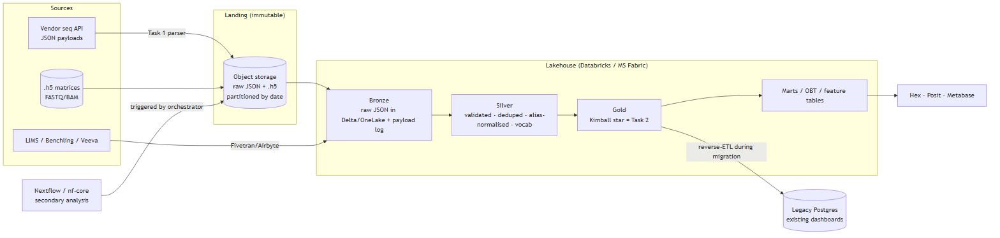

# Platform Architecture (Design)

*The highest-value section: not a tool list, a sequenced plan with a migration story and a boundary
around what we deliberately will **not** do.*

## The problem in one line

Four teams, four numbers, one study, because ingestion is manual laptop scripts, definitions live in
people's heads, and staleness is silent. The platform's job is one governed place where data lands
once, is defined once, and drifts loudly.

## Target architecture (layers)



<sub>Rendered image above; Mermaid source below.</sub>

```mermaid
flowchart LR
    subgraph Sources
      V[Vendor seq API<br/>JSON payloads]
      L[LIMS / Benchling / Veeva]
      H[(.h5 matrices<br/>FASTQ/BAM)]
    end
    subgraph Landing["Landing (immutable)"]
      OBJ[(Object storage<br/>raw JSON + .h5<br/>partitioned by date)]
    end
    subgraph Lakehouse["Lakehouse (Databricks / MS Fabric)"]
      B[Bronze<br/>raw JSON in Delta/OneLake + payload log]
      S[Silver<br/>validated · deduped · alias-normalised · vocab]
      G[Gold<br/>Kimball star (analytical model)]
      M[Marts / OBT / feature tables]
    end
    NF[Nextflow / nf-core<br/>secondary analysis]
    BI[Hex · Posit · Metabase]
    PG[(Legacy Postgres<br/>existing dashboards)]

    V -->|ingestion parser| OBJ --> B --> S --> G --> M
    L -->|Fivetran/Airbyte| B
    H --> OBJ
    NF -->|triggered by orchestrator| OBJ
    M --> BI
    G -->|reverse-ETL during migration| PG
```

Landing is **immutable** raw (never mutated). Bronze is 1:1 with source (raw JSON landed as Delta /
OneLake tables + the payload log). Silver is validated/deduped/conformed with controlled vocabularies.
Gold is the analytical star. Marts are the OBT-style wide extracts. A **reverse-ETL sync from Gold back
into the legacy Postgres** keeps existing dashboards alive *during* migration, the trick that avoids
a freeze. The Bronze→Silver→Gold medallion lives as ACID tables (Delta Lake on Databricks, or Delta
in OneLake on Fabric), so the whole lineage has time-travel, which doubles as the reproducibility
substrate for the analytical layer's *as-was* queries.

## Recommendations & trade-offs (rejected options kept visible)

| Layer | Pick | Why / rejected alternative |
|---|---|---|
| Storage | S3/ADLS (EU region), Parquet + native omics formats | Sequencing artefacts are large binaries; object storage is the only sane home. Keep `.h5`/BAM native for Scanpy/Seurat. |
| Warehouse / lakehouse | **Lakehouse, Databricks *or* Microsoft Fabric** (choose by ecosystem) | Omics = large `.h5` matrices + sparse single-cell + a biomarker/ML roadmap, so a lakehouse that unifies files + ACID tables + Spark + ML in one place beats a SQL-first warehouse. **Databricks:** best-in-class, Delta Lake (ACID + time-travel), Spark for large matrices, MLflow for the ML roadmap, Unity Catalog governance; multi-cloud. **MS Fabric:** unified SaaS, OneLake (single copy of data), Synapse Spark, Data Factory ingestion, native Power BI, Purview governance; least ops if the organisation is a Microsoft/Azure/Power BI shop. **Rejected: Snowflake**, excellent low-ops warehouse and the pick *if the roadmap were BI/SQL-first*, but weaker native fit for heavy Spark/single-cell ML and large-matrix genomics (you'd bolt on Snowpark/containers); **self-managed Postgres** (the bottleneck); **Redshift/standalone Synapse** (more tuning). |
| Orchestration | **Dagster** | Asset-based: "expression depends on sample metadata" is *declared*, with built-in lineage, freshness policies, backfills. Native alternatives (**Databricks Workflows** / **Fabric Data Factory pipelines**) cut a tool for n=2, pick those if you want fewer moving parts; Dagster wins when you need one lineage graph *across* Nextflow + dbt + the lakehouse. Rejected: **Airflow/MWAA** (task-centric, more ops, but pick it if the team already knows it); **Prefect** (weaker asset lineage). |
| Bioinformatics | **Keep Nextflow/nf-core**, orchestrate at the boundary | Do not rebuild secondary analysis in Dagster. Dagster *triggers* Nextflow and owns the data assets it produces. This boundary is the one teams often get wrong. |
| Transformation | **dbt Core** | SQL, version-controlled, tested, self-documenting; biostatisticians can read and contribute. Runs natively on both (`dbt-databricks` is mature; `dbt-fabric` on Fabric warehouse, or Delta Live Tables / Fabric notebooks for the Spark-heavy steps). Rejected: SQLMesh (smaller ecosystem); hand-rolled SQL (today's problem). |
| Ingestion | **Buy** connectors for SaaS (Fivetran/Airbyte, or **Fabric Data Factory** if on Fabric, for LIMS/Benchling/Veeva); **build** for the vendor API (the ingestion pipeline) | No connector exists for a bespoke sequencing API, and the validation logic is domain IP. Don't build what a connector already does. |
| Catalog / governance | **Native lakehouse governance, Unity Catalog (Databricks) / Microsoft Purview (Fabric)** + dbt docs & semantic layer for certified metrics | Catalog, lineage, and access policies ship *with* the platform → fewer moving parts for n=2. "Evaluable sample" defined once, in code, with an owner. Rejected: standalone OpenMetadata/DataHub (only worth it if multi-platform); Collibra/Alation (cost/process weight wrong for this size). |
| Quality | dbt tests as the floor + **Elementary** (or Lakehouse Monitoring on Databricks) for observability; Great Expectations only where dbt can't express it | Freshness + volume anomaly alerts included. |
| BI / analysis | Lakehouse notebooks (Databricks / Fabric notebooks, R & Python) + **Power BI** (native in Fabric) or Hex/Posit | Scientists keep R/Python; they just stop keeping their own copy of the data. Fabric bundles Power BI natively; Databricks pairs with Power BI or Hex/Posit. |
| Secrets / IaC / CI | Terraform, GitHub Actions, cloud secret manager | Change control is the cheap on-ramp to future GxP. |

### Databricks vs Microsoft Fabric: how I'd choose
Both are lakehouses; the tie-breaker is the organisation's ecosystem and team, not raw capability:

- **Pick Databricks if:** multi-cloud or AWS-centric; the single-cell / ML / biomarker roadmap is
  heavy (Spark at scale, MLflow, mature `dbt-databricks`); the team has (or wants) Spark depth. It is
  the most capable engine for large-matrix genomics.
- **Pick Microsoft Fabric if:** the organisation is already a Microsoft/Azure shop with Power BI and Entra ID
  (Azure Active Directory), Fabric collapses ingestion, lakehouse, warehouse, BI, and governance
  (Purview) into **one SaaS bill with the least ops**, which is often decisive for a 1–2 person team.
  OneLake means a single physical copy of the data across all engines.
- **The honest condition that flips it back to Snowflake:** if the roadmap turned out BI/SQL-first
  with little Spark or ML, Snowflake's lower operational surface would win, the omics ML roadmap is
  exactly why it doesn't here.

## Migration: strangler fig, four phases, no boil-the-ocean

1. **Weeks 1–4, foundations, zero disruption.** Repo, CI, Terraform, the lakehouse (Databricks/
   Fabric) workspace, Dagster; replicate the existing Postgres in as a source. Nothing switched off.
   *Deliverable:* everyone queries the same data read-only in one place.
2. **Weeks 4–8, own the highest-pain ingestion.** the ingestion pipeline moves into Dagster; vendor data
   lands automatically and lands *once*. This buys credibility by removing a manual job someone hates.
3. **Weeks 8–16, Gold + certified definitions.** Build the star for the top 3 recurring questions
   only. **Dual-run against the laptop scripts and publish a reconciliation report**; where numbers
   differ, resolve them in a room with all four teams. That reconciliation *is* the deliverable, the
   model is just the vehicle.
4. **Quarter 2+, retire scripts one at a time,** each with a named owner and a "here's the query
   that reproduces your number" hand-off. Scientists keep notebooks; they just point at Gold.

**Explicitly out of scope for year 1** (saying what you won't do matters): raw FASTQ/BAM
lake, MLOps platform, full GxP validation, real-time streaming.

## Orchestration specifics (they ask directly)

- **Trigger:** sensor on the vendor API / S3 landing prefix (or scheduled poll with a watermark) →
  asset materialisation.
- **Retries:** exponential backoff, 3 attempts, safe *because ingestion is idempotent on
  `payload_id`* (the ingestion design, D2). This is the concrete payoff of the idempotency design.
- **Dependencies:** `sample_metadata` asset → `sample_expression` asset, declared so expression can't
  run against a missing parent.
- **Freshness + staleness alerts, not just failure alerts**, silent staleness is the organisation's actual
  bug. Alert to Slack when an asset is overdue even if nothing "failed".
- **Dead-letter + daily digest to the lab** for rejected payloads (the pipeline's `rejected` rows);
  nothing is dropped silently. Backfills are first-class (re-run a study after a parser fix).

## Governance & trust

- **Definitions:** "evaluable sample" / "QC pass" become dbt models with a named business owner, a
  changelog, and tests. One place, versioned, reviewable. The social fix, a small monthly
  data-council with one rep per team, is what makes the technical fix stick.
- **Quality:** boundary validation (the pipeline) + dbt tests (uniqueness, not-null, accepted values,
  referential integrity, domain tests like `pct_mapped BETWEEN 0 AND 100` and "every QC-passed bulk
  sample has ≥1 expression row").
- **Lineage:** Dagster asset graph + dbt DAG + the lakehouse catalog (Unity Catalog / Purview),
  column-level where available, answers "which dashboards break if the vendor changes this field?"
- **Access control for subject data:** subject IDs are pseudonymous; the re-identification key stays
  in the clinical system and never enters the lakehouse. RBAC, row-level policies by study, and
  column masking on quasi-identifiers are enforced natively by **Unity Catalog (Databricks) /
  Purview + row-level security (Fabric)**. **`lab_notes` is free text and a PHI-leak risk, flagged**
  for masking/redaction. EU data residency; DPA with each CRO; right-to-erasure via the
  pseudonymisation boundary. Audit = lakehouse access history (Unity Catalog / Purview audit logs) +
  immutable payload log + git history of every transform.
- **GxP-ready, not GxP-now:** version control, code review, environment separation, automated tests,
  immutable raw layer, and full lineage are the prerequisites for future validation. Doing CSV/IQ-OQ-PQ
  now would be premature, but designing so it is *possible* costs nothing today.

## How the ingestion code evolves

- **Keep:** the parser, alias map, Pydantic validation, domain rules, and tests, the durable IP, and
  the reason for the pure-function layering (D5).
- **Delegate:** scheduling, retries, alerting, secrets, and logging → Dagster; SQL modelling → dbt
  (Python does E+L into Bronze only, dbt does all T); dedup/history → dbt snapshots + incremental
  `MERGE`; the payload log → the immutable landing zone + a Bronze table.
- **Retire:** the hand-rolled `psycopg` connection/transaction plumbing, the bespoke CLI (becomes an
  asset), direct writes into legacy `sample`/`sample_expression` (become dbt models + reverse-ETL so
  dashboards survive), and the local `.env` config.
